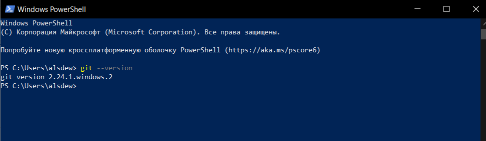

[< к содержанию](./readme.md)

Необходимое ПО.

Проверка наличия GIT на вашем компьютере через *терминал* (командную строку):

```bash=
 git --version
```

Если GIT уже был установлен, вы увидите:



---

В первую очередь надо установить клиент git: обязательно потребуется консольный клиент, доступный по ссылке http://git-scm.com/downloads (поддерживаются основные ОС), графический клиент можно установить по желанию, исходя из своих предпочтений. На Unix системах можно воспользоваться менеджером пакетов (yum на fedora и подобных или apt-get на debian, ubuntu и подобных) вместо того, чтобы скачивать установщик с сайта.

 Настройка git. Нам будет достаточно только задать имя и email командами: 

    git config ­­global user.name "user name" 
    git config ­­global user.email yourEmail

     
Далее работа с git будет объясняться на примере работы с консольным клиентом по следующим причинам:

---

Чтобы у вас складывалось понимание происходящего и при возникновении проблем вы могли четко объяснить, что вы делали, и было видно, что пошло не так.


Все нажатия кнопок в графических клиентах в итоге сводят к выполнению определнных команд консольного клиента, в то же время возможности графических клиентов ограничены по сравнению с консольным


У тех, кто будет работать в классе на стоящих там компьютерах, не будет другого выбора, кроме как пользоваться консольным клиентом (на сколько мне известно, никаких графических клиентов для git там не установлено).